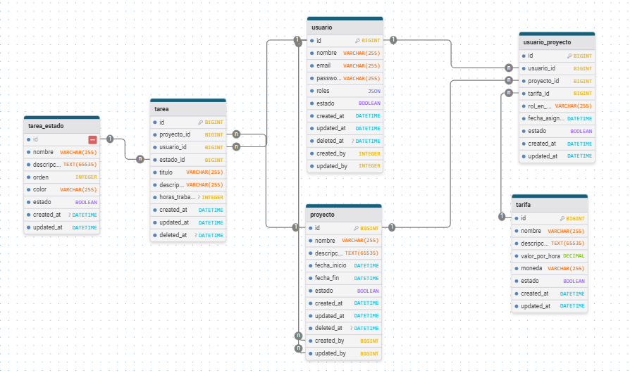

# PruebaTecnicaProyectos
Creación de prueba técnica para postulación a empresa del día 20/02/2026


# Documentación: Creación de Aplicación BACKEND

A continuación describo los pasos que realice para el levantamiento de este proyecto  paso por paso para demostrar lo realizado y que hice para montar todo el proyecto desde cero

## 1. Creacion de proyecto Backend

Ejecuto el comando `symfony new backend` para generar el proyecto de symfony con la estructura basica que se necesita, para tener el esqueleto del proyecto.

```bash
# desde la carpeta de trabajo principal
symfony new backend
```

### 1.1 Configuración inicial

- Ingresar al directorio `backend` y desues abre un servidor en localhost `http://localhost:8000` para la revision del proyecto:

  ```bash
  cd backend
  symfony serve
  ```

## 2. Creación de la Base de Datos

Para la creacion de base de datos utilice el .env para agregar la linea de mysql y poder crear la base de datos con el nombre sistema_proyecto

```bash
# ejemplo en .env
DATABASE_URL="mysql://root:@127.0.0.1:3306/sistema_proyecto?serverVersion=8.0.32&charset=utf8mb4"
```

Luego ejecute:

```bash
gitignore
# crear la base de datos vacía
php bin/console doctrine:database:create
```

## 3. Instalación de Paquetes Adicionales

Para realizar un desarrollo mas rapido instalare paquetes que me ayuden a crear controladores, migraciones, entidades y lo que se requiera.

```bash
composer require symfony/maker-bundle --dev
composer require symfony/orm-pack
composer require api #Comando para instalar api-platform para realizar ApiRest mas facilmente.
```

## 4. Creación de Entidades

Antes de realizar las entidades genere un MER (Modelo Entidad Relación)

https://www.drawdb.app/editor?shareId=7a95e36ffb6a4b3c3ba015a3ad88de3a



Ya credo y diseñado el MER se puede realizar la creacion de las entidades y las migraciones.

Con el maker bundle genere las siguientes usuarios y entidades

```bash
php bin/console make:user #Con el nombre Usuario
```
Despues de crear los campos, cree unos Traits para la realizacion de auditoria, esto lo realizo para utilizarlos en cualquier entidad y que la entidad quede mas limpia para no repetir codigo.

```txt
  BlameableTrait
  SoftDeleteTrait
  TimestampableTrait
```

ahora creo las demas entidades:

```bash
php bin/console make:entity Proyecto
php bin/console make:entity Tarifa
php bin/console make:entity UsuarioProyecto
php bin/console make:entity TareaEstado
php bin/console make:entity Tarea
```

Despues de esto se Realiza la creacion de la migracion con siguiente comando:


```bash
php bin/console make:migration
php bin/console doctrine:migrations:migrate
```

Ya teniendo las tablas en base de datos ahora se puede realizar el api con API PLATFORM.


## 4. Creación APIS CON APIPLATFORM
Se realiza la implementacion de API SOURSE EN LAS ENTIDADES

El procesador de softdelete se encarga de eliminar logicamente las entidades, entonces se realiza el cambio de que no se elimine el registro de la tabla, sino que se actualice el campo estado a false.

```php
#[ApiResource(
    operations: [
        new GetCollection(),
        new Post(),
        new Get(),
        new Put(),
        new Patch(),
        new Delete(processor: SoftDeleteProcessor::class) # Procesador modificado para borrado lógico
    ]
)]
```

despues de esto y avanzando en el desarrollo colocaba Groups para la optencion y edicion de datos dentro de las diferentes vistas de api platoform, normalizando y desnormalizando tipos de datos o fechas dependiendo de la necesidad del frontend.

Un ejemplo de esto es el siguiente donde realizo un parametro de busqueda para usuarios y proyecto y tambien normalizo infirmaicion para tareas de lectura, y desnormalizo la informaicon para escritura, esto se hace por tipos defechas y otros datos.

```php
#[ApiFilter(SearchFilter::class, properties: ['proyecto' => 'exact', 'usuario' => 'exact'])]
#[ApiResource(
    operations: [
        new GetCollection(normalizationContext: ['groups' => ['tarea:read', 'timestamp:read']]),
        new Post(
            normalizationContext: ['groups' => ['tarea:read', 'timestamp:read']],
            denormalizationContext: ['groups' => ['tarea:write']]
        ),
        new Get(normalizationContext: ['groups' => ['tarea:read', 'timestamp:read']]),
        new Put(
            normalizationContext: ['groups' => ['tarea:read', 'timestamp:read']],
            denormalizationContext: ['groups' => ['tarea:write']]
        ),
        new Patch(
            normalizationContext: ['groups' => ['tarea:read', 'timestamp:read']],
            denormalizationContext: ['groups' => ['tarea:write']]
        ),
        new Delete(processor: SoftDeleteProcessor::class)
    ],
    normalizationContext: ['groups' => ['tarea:read', 'timestamp:read']],
    denormalizationContext: ['groups' => ['tarea:write']]
)]
```

## 5. Implementación de un Punto de Login (Autenticación para Usuarios y Administradores)

Para establecer un punto de login seguro dentro de la API Rest y permitir la autenticación y autorización se empleara por JWT.

Instale el paquete encargado de gestionar los tokens JWT:

```bash
composer require lexik/jwt-authentication-bundle
php bin/console lexik:jwt:generate-keypair #esto es para generar las claves publica y privada
```

los tokens se generaron en la carpeta config/jwt/

El enrutamiento y la protección de accesos se configuran en `config/packages/security.yaml`. Es donde realice la configuración de los usuarios y los roles para la aplicacion .

Se parametrizo el endpoint `/api/login_check` en el archivo `config/routes.yaml` para que el sistema utilice este para el login:

```yaml
# config/routes.yaml
api_login_check:
    path: /api/login_check
```
con esto nos puede generar un token para poder acceder a las apis protegidas.

Una vez aplicadas estas configuraciones, ya tenemos un punto de acceso plenamente funcional. Enviamos una solicitud `POST` directamente hacia `/api/login_check` con las credenciales correspondientes que se crearon en la base de datos. 

**Petición HTTP:**
```json
POST /api/login_check
Content-Type: application/json

{
  "email": "[EMAIL_ADDRESS]",
  "password": "[PASSWORD]"
}
```

**Respuesta Exitosa:**
```json
{
    "token": "eyJhbGciOiJSUzI1NiIsInR5cCI..."
}
```

Con el token brindado, cualquier cliente deberá añadir este Token a la cabecera HTTP (`Authorization: Bearer <TU_TOKEN>`) para enviar peticiones futuras a las entidades protegidas por API Platform.


# Documentación: Creación de Aplicación FRONTEND

Para realizar el frontend se utilizara Vite con React y TailwindCSS. Tambien implemento axios con Auth.js para el manejo de tokens.

```bash
npx -y create-vite@latest frontend --template react
```

ahora la instalacion de los paquetes que instale:

```bash
npm install -D tailwindcss
npm install -D postcss
npm install -D autoprefixer
npx tailwindcss init -p
npm install primereact
npm install primeicons
npm install axios
npm install @auth/core
npm install react-router-dom
npm install zustand
npm install jsonwebtoken
```

## 6. Mejoras que hice en el funcionamiento (Frontend y Seguridad)

Para que la página no solo se vea bien, sino que sea segura y fácil de usar, le metí mano a varias cosas importantes:

### 6.1 Registro de tareas más sencillo
Diseñé la parte de las tareas para que fuera muy práctica. Lo que hice fue:
- **Asignación automática**: Para que el usuario no tenga que estar buscándose en una lista cada vez que crea una tarea, el sistema ya sabe quién es y se la asigna solito.
- **Ver lo que hacen los demás**: Puse un filtro para que puedas ver qué tareas han registrado tus compañeros en el proyecto, así todos saben en qué anda el equipo.
- **Solo tú mandas en lo tuyo**: Hice que el botón de editar solo aparezca en las tareas que tú mismo creaste. Así nadie más puede cambiar tus horas o tus descripciones por error.

### 6.2 Cuentas seguras (Hasheo de contraseñas)
Me aseguré de que las contraseñas nunca viajen ni se guarden como texto normal:
- Cuando alguien crea un usuario o cambia su clave, el sistema la "disfraza" (hashea) automáticamente antes de guardarla en la base de datos. Así, aunque alguien entrara a mirar la tabla de usuarios, no podría ver las contraseñas reales.

### 6.3 Cómo organicé las llamadas y los datos (Axios y Zustand)
Para que el código no fuera un desorden y las cosas cargaran rápido:
- **Llamadas inteligentes con Axios**: Creé un archivo central para todas las conexiones. Le puse una regla para que le "pegue" el permiso de seguridad (el token) a cada consulta que hagamos. Así me ahorro escribir el código de seguridad en cada botón o página.
- **Memoria del usuario con Zustand**: Usé Zustand para guardar los datos del usuario logueado. Es como una pequeña memoria que le dice a toda la página quién eres, para que me salude por mi nombre en el menú y sepa qué tareas mostrarme sin tener que preguntarle al servidor a cada rato.

### 6.4 Detalles visuales premium
- Usé **PrimeReact** para que las tablas se vean profesionales, con botones elegantes y colores que cambian según el estado de la tarea (si está pendiente, en proceso o terminada). 
- También arreglé el formato de las fechas para que se vean claras y fáciles de leer, con el día y la hora exacta de la última actualización.
